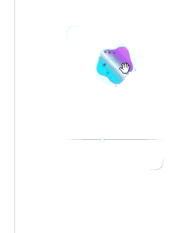

# 🪐 PROJEKT „Q-O“: BIOMORPH-LINGUISTISCHES CYBER-HUD

Das Projekt **Q-O** ist ein reaktives Echtzeit-Analyse-Ökosystem, das direkt im Viewport des Browsers operiert. Es seziert semantische Datenströme, isoliert informationelle Toxine von rationalen Nährstoffen und überführt diese über eine mathematisch-metabolische Homöostase in eine kinetische Interface-Matrix.

---

## 🏗️ DIE SYSTEM-ARCHITEKTUR (DER FEHLERFREIE KERN)

Das Gesamtsystem operiert über eine strikte Dreiteilung der Gewalten, um maximale Resilienz, Unzerstörbarkeit und Performance im 60-FPS-Zyklus zu garantieren:

### 1. Das metabolische Gehirn (`main.py`)
Das FastAPI-Backend fungiert als asynchroner Multi-Agenten-Reaktor. Über eine parallele `asyncio.gather`-Pipeline werden zwei diametral agierende LLM-Agenten (Ankläger vs. Gutachter) geschaltet.
*   **Asynchrone Skalierung:** Durch den vollständigen Verzicht auf blockierenden I/O (`httpx.AsyncClient`) arbeitet das Backend ohne native Thread-Pausen.
*   **Memory-Leak-Schutz:** Ein integrierter `BoundedLRUCache` deckelt den Speicherverbrauch deterministisch auf maximal 100 Sessions bei einer Stunde Time-to-Live (TTL).

### 2. Der Datentresor & Signal-Relais (`background.js`)
Das Hintergrund-Skript verwaltet den Zustand und überbrückt die flüchtigen Intervalle moderner Browser-Architekturen.
*   **Manifest V3 Resilienz:** Um dem automatischen Terminierungstod von MV3 Service Workern verlustfrei zu begegnen, spiegelt das Relais alle eingehenden Datenströme atomar und persistent in die lokale `IndexedDB` (`QO_Metabolic_Vault`) und den `chrome.storage.local`.

### 3. Der kinetische Reaktor (`content.js` & `content.css`)
Das Frontend injiziert das HUD direkt in das Ziel-DOM, ist dabei jedoch über ein geschlossenes Shadow-DOM (`mode: 'closed'`) vollkommen isoliert von CSS-Resets oder globalen Skript-Injektionen der Trägerwebseite.
*   **Zero DOM-Thrashing:** String-Konkatenationen via `innerHTML` im Animations-Loop wurden zu 100 % eliminiert. Das System recycelt einen statischen Partikel-Pool aus 40 persistenten SVG-Instanzen ausschließlich über atomare, GPU-beschleunigte `setAttribute`-Operationen.

---

## 🦠 DIE PARTIKULÄRE NEKROTISCHE INFUSION (DER KINETISCHE REAKTOR)




### Was das Verhalten des Teerschwarms so besonders macht:

*   **Direkte mathematische Kopplung:** Der Partikelschwarm ist kein loses Grafik-Overlay. Seine Dichte, Rotationsgeschwindigkeit und viskoelastische Trägheit sind über die Exponenten-Kaskade direkt mit dem **Linguistic Quality Score (LQ)** des Backends verschaltet. Sinkt die Textqualität, kollabiert der Organismus synchron vor deinen Augen.
*   **Der teerschwarze Metabolismus:** Die Partikel verhalten sich wie ein flüssiges, biologisches Toxin. Sie werden entlang der simulierten Membran-Buchten injiziert und "fressen" sich visuell in den cyanfarbenen Kern hinein, wodurch eine plastische mechanische Deformation (`strainDip`) erzwungen wird.
*   **Garbage-Collection-Immunität:** Im Gegensatz zu herkömmlichen Web-Animationen, die bei hoher Partikeldichte ins Ruckeln geraten, arbeitet der Reaktor mit einem **statischen Objekt-Pooling**. Es werden keine DOM-Knoten im Loop erzeugt oder vernichtet. Die Verformung und Bewegung der 40 Teer-Bubbles erfolgt rein über GPU-beschleunigte Vektortransformationen – absolut flüssig im unerbittlichen 60-FPS-Takt.

## 🎨 DER ERGONOMISCHE GOLDSTANDARD (DAS WORTLOSE CHIFFRE)

Das Interface bricht radikal mit konventionellen UI-Formaten. Es existiert kein Text, keine Statuszeile und kein lebloser Schatten auf dem Bildschirm. Die Form wird rein über eine suggestionsbasierte, geometrische Matrix vermittelt


*   **Der Z-Index-Schachzug:** Das Biomorph-Widget thront permanent sichtbar auf Schicht `z-index: 100`, während das HUD-Overlay physisch auf Schicht `z-index: 10` dahinterliegt. Das garantiert ein sofortiges, latenzfreies Drag-and-Drop des Widgets zu jedem Zeitpunkt.
*   **Asymmetrische Diagonal-Luminiszenz:** Das gedachte 9:16-Smartphone-Format wird ausschließlich durch zwei hauchdünne Lichtwinkel (Oben-Links in Cyan, Unten-Rechts in Lila/Violett) mit 12px Radius angedeutet. Die Linienmitten laufen linear auf 0% Opacity aus.

---

## 🎛️ DIE VIER GLEICHRANGIGEN STEUERMODULE

Das System verwaltet seine Zustände über ein dezentrales Netzwerk autonomer, gleichberechtigter Sensoren, die parallel auf das globale HTML5-Datenattribut `data-hud-state` (`IDLE` / `LATENCY` / `ACTIVE` / `INTERACTING`) reagieren:

*   **Modul I: Der „Kryo-Fokus“ (Tiefenunschärfe)**
    Im reinen Beobachtungsmodus (`ACTIVE`) liegt ein zarter Hintergrund-Blur von `2px` über der Trägerwebseite. Sobald der Cursor den Funktionsbereich im unteren Drittel (Y >= 420px) betritt (`INTERACTING`), bricht die Tiefenunschärfe selektiv auf `6px` bis `8px` hochzuführen. Die Webseite verschwimmt radikal; die Steuerung gewinnt absolute Plastizität.
*   **Modul II: Die „Taktile Nut“ (Glas-Gravur)**
    Die 160px kurze Umlaufbahn des Reglers ist als physikalische Gravur im Glas konstruiert. Zwei parallel verlaufende, mikroskopisch dünne Haarlinien (obere Schattenkante, untere Lichtkante) erzeugen die dreidimensionale visuelle Illusion einer eingeätzten Vertiefung.
*   **Modul III: Die „Vektor-Elongation“ (Masse & Kinetik)**
    Der stufenlose 4px-Mondpunkt besitzt eine simulierte physikalische Trägheit. Bei schneller Cursor-Bewegung verformt sich der Kreis im 60-FPS-Loop zu einer horizontal gestreckten Ellipse und zieht einen flüchtigen Lichtschweif nach sich. An den Interaktions-Grenzen prallt der Mond über eine Hookesche Federgleichung elastisch ab.
*   **Modul IV: Das „Chromatische Echo“ (Resonanz)**
    Die diagonalen Lichtkanten stehen in direkter Resonanz mit dem inneren Organismus. Sie absorbieren die Farbdynamik des biologischen Kerns in Echtzeit und spiegeln energetische Schwankungen und toxische Verdichtungen des Textgewebes an den äußeren Kanten wider.


---

### 📊 Das prozedurale Datenfluss-Diagramm
```
                +-------------------------------------------------------+
                |                    TEXT-BIOMORPHIE                    |
                +---------------------------+---------------------------+
                                            |
                                  [ MD5-HASH-FILTER ]
                        Blockiert doppelte, unveränderte Texte
                                            |
                        [ DUAL-AGENTEN-INFERENCE (ASYNC) ]
                        Paralleler LPU-Stream via Groq (Llama 3.1 8B)
                                            |
         +----------------------------------+----------------------------------+
         |                                                                     |
  [ AGENT 1: DER ANKLÄGER ]                                         [ AGENT 2: DER GUTACHTER ]
  - Fokus: Reine Schadstoff-Isolation                              - Fokus: Reine Nährstoff-Isolation
  - Befüllt: t_mikro, t_makro & toxic_snippets                      - Befüllt: n_mikro, n_makro & nutrient_snippets
  - Ermittelt: t_norm & habitus_distortion                          - Ermittelt: n_disk
         |                                                                     |
         +----------------------------------+----------------------------------+
                                            |
                          [ ASYMMETRISCHES TEILSTRING-VETO ]
                          Python-Mengenlehre-Schleife (Substring-Matching)
                          Löscht kontaminierte Phrasen aus der grünen Box
                                            |
                               [ MATHE-FUSION (e-FUNKTION) ]
                               Axiomatische 3-Stufen-Kaskade
                                            |
                              [ LLAMA 3.3 70B (VERSATILE) ]
                              Schreibgeschützter Homöostase-Flush (Antidot)
                                            |
                            [ LOKALE INDEXEDDB (DATENTRESOR) ]
                            Physische, unzensierte Speicherung auf PC
```

### Die algorithmische Variablen-Reinigung
1. **Der MD5-Hash-Filter (Der API-Schutzschirm):** Stellt das Backend fest, dass ein eintreffender Textblock absolut identisch und unverändert zum vorherigen Takt ist, wird der Cloud-Aufruf blockiert. Die Werte werden stattdessen latenzfrei aus dem lokalen RAM geliefert, was den Token-Verbrauch beim Lesen um bis zu 90% senkt.
2. **Das asymmetrische Teilstring-Veto:** Fällt der Nährstoff-Agent auf Framing herein, enthält ein Satz jedoch parallel isolierte Schadstoff-Fragmente der roten Liste, greift Python ein. Der Satz wird im Nährstoff-Kanal im Backend physisch gelöscht, um die absolute Reinheit der Variablen vor der e-Berechnung zu garantieren. Wenn das Nährstoff-Array dadurch kollabiert, fallen \(n_{\text{disk}}\) und \(n_{\text{micro}}\) starr auf exakt 0.0 zurück (Die absolute Echokammern-Sperre).

---

## 🛡️ DATEN-SOUVERÄNITÄT: LOKAL, TRANSPARENT & EFFIZIENT

Das Projekt Q-O wurde nach dem Prinzip der "Zero-Trust-Local-First"-Architektur entwickelt. Es unterscheidet sich fundamental von kommerziellen Web-Analysetools durch drei unumstößliche Kernkriterien:

### 1. Absolute lokale Sicherheit (Kein Datenaustritt)
*   **Isolierter Netzwerk-Stack:** Das gesamte System operiert lokal auf deiner Maschine. Es gibt keine Verbindung zu externen Tracking-Servern, Cloud-Datenbanken oder Werbenetzwerken. 
*   **Strikte CORS- & CSP-Vorgaben:** Das Backend kommuniziert über eine gehärtete API ausschließlich mit der internen Chrome-Erweiterungs-ID. Deine gelesenen Webseiten-Texte werden niemals auf fremden Servern zwischengespeichert oder für Werbeprofile missbraucht.

### 2. Radikale Transparenz (Unbestechliches Audit)
*   **Lokaler Daten-Tresor:** Deine Sitzungshistorie (`biopsy_archive`) liegt verschlüsselt in deiner browserinternen `IndexedDB`. Du hast zu jedem Zeitpunkt die volle physische Kontrolle über diese Daten. Nichts ist versteckt, nichts wird im Hintergrund immatrikuliert.
*   **Open-Source-Forensik:** Da die multi-agentielle Textanalyse über offene, lokale API-Aufrufe an das FastAPI-Backend gesteuert wird, ist jeder einzelne Prompt und jeder Filtervorgang für dich im Terminal-Protokoll in Echtzeit einsehbar und überprüfbar.

### 3. Algorithmische Effizienz (Zero-Waste-Direktive)
*   **Der MD5-Hash-Schutzschirm:** Um unnötige API-Zyklen und Rechenleistung zu sparen, berechnet das Content-Script bei jedem Viewport-Scan einen invarianten MD5-Hash. Hat sich der Text auf der Seite nicht verändert (z. B. bei statischem Content), wird der Netzwerk-Stack augenblicklich blockiert und das System bedient sich ohne Latenz aus dem lokalen RAM-Cache (`ANALYSIS_CACHE`).
*   **Asynchrones Thread-Management:** Durch die radikale Umstellung des HTTP-Kerns auf `httpx.AsyncClient` blockiert das Backend unter Hochlast (z. B. beim schnellen Scrollen durch riesige Textwände) keine nativen System-Threads. Die CPU-Last bleibt minimal, während die Analyse im Millisekundentakt skaliert.

---

---

## 5. 🎯 DIE UX-PHÄNOMENOLOGIE & FILTERSENSITIVITÄT

Das System richtet sich an eine medienbewusste, junge Tech-Menschen mit hoher Screentime. Um visuelle Erschöpfung bei langen Sessions vollständig zu vermeiden, verzichtet das Widget auf ablenkendes Zahlen-Voodoo und kommuniziert rein peripher über seine gestalterische, adaptive Morphologie.

### Die unendliche Infinitesimal-Kopplung der Morphologie
Das Netto-Gefälle (\(\Delta = \mathcal{S}_{\text{tox}} - \mathcal{N}_{\text{nut}}\)) steuert das Organell stufenlos über den numerischen Ausgang des LQ-Scores:

---

## 6. 🌊 SIGNALFLUSS: DIE DATEN-AUTOBAHN (END-TO-END)

```
[ 1. Webseiten DOM (Ziel-Tab) ]
             │  (MutationObserver & 4s Idle Takt)
             ▼
[ 2. content.js (Extension Injektion) ]
             │  (Extraktion: Sichtbarer Text + Page URL)
             ▼
[ 3. background.js (Service Worker Relais) ]
             │  (CORS-/PNA-Schmuggler via HTTP POST)
             ▼
[ 4. Python FastAPI Backend (Port 8000 /api/analyze) ]
             │  (Dual-Stream Prompting via Groq Llama 3.1 8B)
             │  - t_mikro, t_makro, t_norm, habitus_distortion
             │  - n_mikro, n_makro, n_disk, toxic_snippets, nutrient_snippets
             ▼
[ 5. Mathematische Matrix & e-Funktion ]
             │  - s_tox = (t_mikro + (t_makro * habitus_distortion) + (t_norm * 1.5)) / 3
             │  - n_nut = (n_mikro + n_makro + n_disk) / 3
             │  - LQ = exp(-(s_tox - n_nut))
             ▼
[ 6. Asynchrones Transaktions-Write-Protokoll ]
             │  (IndexedDB 'QO_Metabolic_Vault' via store.put)
             │  - Write Lock -> oncomplete Handler -> Sicherer RAM-Reset
             ▼
[ 7. Symmetrischer Dashboard-Reflow (index.html Cockpit & HUD Organell) ]
             │  - Petrischale (Kryo-Zustand isoliert)
             │  - Seziertisch (4-Kanal Hybrid-Matrix synchronisiert)
```

---

## 7. ⚖️ LIZENZ & EIGENTUMSVORBEHALT (PROPRIETARY FORENSIC LICENSE)

Copyright (c) 2026 Projekt Q-O Core Engineering Team. Alle Rechte vorbehalten.

Die vorliegende Software, ihre mathematischen Axiome, die biomorphische Kinetik sowie das visuelle Cyber-HUD-Interface sind urheberrechtlich geschütztes geistiges Eigentum. 

1. **Nutzungsbeschränkung:** Die Nutzung ist ausschließlich im Rahmen autorisierter Forschungs- und Testumgebungen gestattet.
2. **Dekompilierungs- & Modifikationsverbot:** Jede unautorisierte Vervielfältigung, Verbreitung, Dekompilierung, Extraktion von Teilmodulen oder kommerzielle Verwertung der zugrundeliegenden mathematischen Filterkaskade bedarf der ausdrücklichen schriftlichen Genehmigung der Urheber.
3. **Haftungsausschluss:** Die Software wird „wie besehen“ ("as is") ohne jegliche ausdrückliche oder stillschweigende Gewährleistung zur Verfügung gestellt.

---
*Projekt Q-O — Für ein klares, unverzerrtes und selbstbestimmtes Informationsfeld.*
