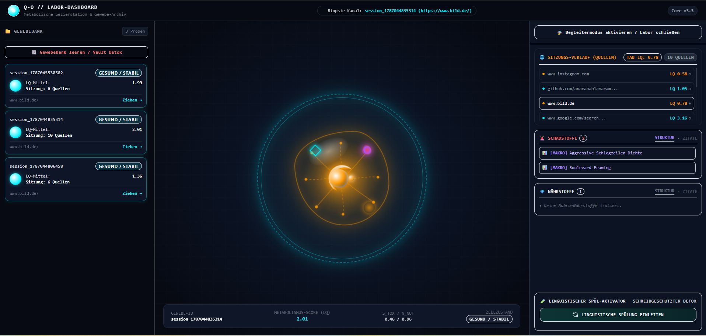

# 🧬 PROJEKT Q-O // Lingu-Blob 
#  Großäugig -  Sensibel  - Diskret

> **Assistiver, peripherer Biosensor & forensisches Cyber-Cockpit zur Echtzeit-Messung reizabhängiger Informations-Ökologie**

---

## 1. 🟢 GRUNDFUNKTION: DER DIGITALE BIOSENSOR FÜR INFORMATIONS-HOMÖOSTASE

Das Projekt **Q-O** ist ein nicht-invasiver, assistiver Biosensor für das offene Textfeld des Internets. Das System fungiert als kognitive Membran zwischen digitaler Reizüberflutung und menschlicher Informationsaufnahme. 

Anstatt Inhalte durch Zensur, Ad-Blocker oder autoritäre Filterlisten zu sperren, quantifiziert Q-O die **Informations-Homöostase** einer Webseite in Echtzeit:
* **Fakten-Nährwert ($\mathcal{N}_{\text{nut}}$):** Dichte an empirischer Substanz, logischer Beweisführung, methodischer Transparenz und konstruktivem Erkenntnisgewinn.
* **Manipulative Toxizität ($\mathcal{S}_{\text{tox}}$):** Konzentration von affektivem Framing, künstlicher Empörung, reißerischer Verknappung, Clickbait-Konditionierung und logischen Fehlschlüssen.

Q-O transformiert unstrukturierte Textmassen in eine lebendige metabolische Signatur, visualisiert diese als ruhige biologische Morphologie direkt im Sichtfeld und stellt bei Bedarf ein forensisches Sezierlabor zur Verfügung.

---

## 2. 👁️ WIDGET: DER PERIPHERE BEGLEITER (HUD & BIO-KINETIK)

Das Widget lebt als unaufdringliches, schwebendes Bio-Organell direkt im aktiven Browser-Tab. Es integriert sich nahtlos in das periphere Gesichtsfeld des Lesers, ohne den Textfluss oder das Layout der Zielseite zu unterbrechen.

(assets/widget-preview.png)

```
+-------------------------------------------------------------+
|  Äußere Membran (Weich gerundetes Bio-Fluidum, HSB-Glow)    |
|   +-----------------------------------------------------+   |
|   |  Gläserner Innenkern (Glassmorphism Core)           |   |
|   |                                                     |   |
|   |       [ Kreis ]         [ Oval ]      [ Splitter ]  |   |
|   |       Stabilität         Stress          Toxin      |   |
|   |       (Homöostase)     (Agitation)    (Affekt-Gift) |   |
|   |                                                     |   |
|   |   Zentrierter Puls   Asymmetrie-Zug   Kristall-Gefahr|  |
|   +-----------------------------------------------------+   |
+-------------------------------------------------------------+
```

### Die drei inneren geometrischen Organellen
Im gläsernen Kern des Widgets schweben drei geometrisch distinkte Organellen, die als permanente Potentialpunkte agieren:
1. **Der Kreis (Stabilität & Homöostase):** 
   Ruht perfekt zentriert. Pulsiert in sanftem, tiefem Rhythmus (Cyan/Smaragd). Zeigt an, dass der Text reich an Nährstoffen ist und keine affektiven Verzerrungen aufweist.
2. **Das Oval (Stress & kognitive Agitation):**
   Verzieht die Achsen-Symmetrie bei steigendem Bias oder künstlicher Verknappung. Die Frequenz beschleunigt sich, die Färbung wechselt in wärmere Bernstein-/Orange-Töne.
3. **Der zackige Splitter (Toxin & Affekt-Vergiftung):**
   Wird bei akuter Toxizität oder massiver Schlagzeilen-Agitation im inneren Kern aktiviert. Er symbolisiert spitze, verletzende Argumentationsmuster und affektive Trigger.

---

## 🧪 3. LABOR (Das Cyber-Cockpit)

Das Cyber-Labor ist deine forensische Einsatzzentrale. Es ist als gläsernes 3-Zonen-Layout konzipiert:
*   **Zone 1 (Links):** Die Gewebebank mitsamt der Kapsel-Chronologie und dem sterilen "Vault Detox"-Hebel.
*   **Zone 2 (Mitte):** Die biologische Petrischale. Ein nacktes, textfreies Licht-Organ, das rein über Kinetik, Atemfrequenz und Farb-Morphing den Zustand des Gewebes spiegelt.
*   **Zone 3 (Rechts):** Der Seziertisch. Ein perfekt symmetrisches 2-Boxen-Tab-System, das Schadstoffe und Nährstoffe strikt trennt.

### 📸 SYSTEM-INSIDERSICHT


*Befund im Feldtest: Der äußere Halo-Aura-Ring der Petrischale wahrt unerschütterlich das globale Sitzungs-Gedächtnis (Cyan), während der innere Zellkern reaktiv auf den Zustand der ausgewählten URL anspringt. Rechts schalten die Tabs blitzschnell zwischen Makro-Strukturen und Mikro-Zitaten um.*

---

## 4. 🧠 FUNKTIONSWEISE ANALYSE: SPRACHMODELLE & MATHEMATISCHE FORMEL

### Die kinetische Homöostase-Formel
Der **Linguistic Quality Index ($LQ$)** berechnet sich aus dem exponentiellen Spannungsfeld zwischen manipulativen Toxinen und informationellem Nährwert:

$$LQ = e^{-(\mathcal{S}_{\text{tox}} - \mathcal{N}_{\text{nut}})}$$

* Wenn $$\mathcal{S}_{\text{tox}} = \mathcal{N}_{\text{nut}}$$, ist $LQ = e^0 = 1.0$ (Neutraler Gleichgewichtszustand).
* Wenn $$\mathcal{N}_{\text{nut}} > \mathcal{S}_{\text{tox}}$$, wächst $LQ > 1.0$ (Hohe Nährstoffdichte, regenerative Informationsaufnahme).
* Wenn $$\mathcal{S}_{\text{tox}} > \mathcal{N}_{\text{nut}}$$, fällt $LQ \to 0$ (Hohe Toxizität, kognitive Überlastung).

### Das duale Berechnungs-Gesetz (Mikro- und Makro-Fusion)
Um sowohl mikroskopische Textphrasen als auch ganzheitliche strukturelle Muster lückenlos zu erfassen, fusioniert Q-O auf einer Skala von $0.0$ bis $5.0$ zwei Beobachtungsebenen:

$$\mathcal{S}_{\text{tox}} = \frac{T_{\text{mikro}} + T_{\text{makro}}}{2}, \quad \mathcal{N}_{\text{nut}} = \frac{N_{\text{mikro}} + N_{\text{makro}}}{2}$$

```
                +-------------------------------------------------------+
                |                    TEXT-BIOMORPHIE                    |
                +---------------------------+---------------------------+
                                            |
                    +-----------------------+-----------------------+
                    |                                               |
         [ MIKRO-EBENE (ZITATE) ]                        [ MAKRO-EBENE (STRUKTUR) ]
         Isolierte Sätze & Phrasen                       Ganzheitliches Textfeld
         - Alarmistische Reizwörter                      - Aggressive Schlagzeilen-Dichte
         - Clickbait-Phrasen                             - Fehlende Primärquellen
         - Methodische Belege                            - Logische Argumentationskette
                    |                                               |
                    +-----------------------+-----------------------+
                                            |
                               [ DUALER LLM-STREAM ]
                                            |
         +----------------------------------+----------------------------------+
         |                                                                     |
  Llama 3.1 8B (Groq JSON)                                         Llama 3.3 70B (Versatile)
  - 4-Sekunden-Takt                                                - Schreibgeschützter Flush
  - t_mikro, t_makro, n_mikro, n_makro                             - Kontext-Antidot & Bereinigung
  - JSON-Schema mit 4 Arrays                                       - LQ-Boost Rekonstruktion
```

---

## 5. 🏄‍♂️ HYPOTHETISCHE SURFERFAHRUNG: DREI FORENSISCHE STATIONEN

### Station 1: Der Wikipedia-Tiefgang (Enzyklopädische Homöostase)
* **Ziel:** `de.wikipedia.org/wiki/Photosynthese`
* **Textbeschaffenheit:** Neutraler Duktus, dichte Quellenangaben, kausale Erklärungen, keinerlei Adjektiv-Überladung.
* **Phänomenologie des Widgets:**
  * **Farbe:** Klares, tiefes Cyanblau (`#06b6d4`) bis Smaragdgrün.
  * **Kinetik:** Extrem langsames, beruhigendes Atmen ($0.4\text{ Hz}$). 
  * **Organell:** Der **Kreis** verharrt millimetergenau im mathematischen Zentrum des Glaskerns.
  * **Messwerte:** $T_{\text{mikro}} = 0.0$, $T_{\text{makro}} = 0.0$, $N_{\text{mikro}} = 4.2$, $N_{\text{makro}} = 4.8 \implies LQ \approx 2.45$.

```
[ WIKIPEDIA ] ───►  (  ●  )  Cyan-Puls (0.4 Hz)  ───►  LQ: 2.45  (Perfekte Homöostase)
```

---

### Station 2: Der Clickbait-Artikel (Kognitiver Stress & Framing)
* **Ziel:** Viral-Blog: *"Diese 5 geheimen Tech-Tricks werden dein Leben für immer verändern (Nummer 3 ist illegal!)"*
* **Textbeschaffenheit:** Künstliche Verknappung, FOMO, übertriebene Superlative, geringer Faktengehalt.
* **Phänomenologie des Widgets:**
  * **Farbe:** Wärmeres Bernstein/Orange (`#f59e0b`).
  * **Kinetik:** Unruhige, asymmetrische Oszillation ($1.2\text{ Hz}$), feine zelluläre Zuckungen.
  * **Organell:** Der innere Kreis kontrahiert zu einem **Oval**, das leicht nach links oben driftet.
  * **Messwerte:** $T_{\text{mikro}} = 3.2$, $T_{\text{makro}} = 2.8$, $N_{\text{mikro}} = 0.8$, $N_{\text{makro}} = 1.0 \implies LQ \approx 0.36$.
  * **Im Seziertisch:** Identifiziert Zitate wie *"wird dein Leben für immer verändern"* und strukturelle Makro-Kategorien wie `📊 [MAKRO] Reißerische Verknappung`.

```
[ CLICKBAIT ] ──►  (  ⬭  )  Bernstein-Drift (1.2 Hz) ──►  LQ: 0.36  (Kognitiver Stress)
```

---

### Station 3: Die Boulevard-Startseite (Makro-Toxizität ohne Zitate)
* **Ziel:** `b1ld.de` Startseite
* **Textbeschaffenheit:** Eine Ansammlung aus Teasern, isolierten Reizwörtern ("HAMMER!", "SKANDAL!", "BLUT-DRAMA!"), Angst-Induktion und Großbuchstaben. Häufig keine zusammenhängenden grammatikalischen Sätze im DOM.
* **Phänomenologie des Widgets:**
  * **Farbe:** Glühendes Warn-Rot (`#ef4444`) mit violettem Unterton.
  * **Kinetik:** Schneller, spitzer Puls ($2.1\text{ Hz}$). Die äußere Hülle bleibt weich gerundet, aber der innere Glaskern zeigt extreme innere Spannung.
  * **Organell:** Das Organell zieht sich zu einem **zackigen Splitter** zusammen.
  * **Messwerte:** $T_{\text{mikro}} = 1.0$ (kaum zitierbare Sätze), aber $T_{\text{makro}} = 4.9$, $N_{\text{mikro}} = 0.1$, $N_{\text{makro}} = 0.2 \implies LQ \approx 0.08$.
  * **Der Forensik-Effekt im Seziertisch:** Da keine vollständigen Sätze als Mikro-Zitate existieren, schaltet die Schadstoff-Zentrale automatisch auf **STRUKTUR** und belegt die Toxizität lückenlos über `📊 [MAKRO] Aggressive Schlagzeilen-Dichte` und `📊 [MAKRO] Affektive Hysterie`.

```
[ BILD.DE ] ───►  (  ▲  )  Roter Reizpuls (2.1 Hz)   ──►  LQ: 0.08  (Reine Makro-Toxizität)
```

---

## 6. 🧘 UEX FIRST: DIE PHILOSOPHIE DER ABSOLUTEN ABLENKUNGSFREIHEIT

Q-O bricht radikal mit traditionellen Warn-Popups, aggressiven Banner-Einblendungen oder moralisierenden Zensur-Overlays:

1. **Konstante äußere Kontur (Keine äußere Mutation):**
   Die äußere Membran des Widgets bleibt immer organisch, weich gerundet und fließend. Sie mutiert **niemals** nach außen in zackige Stacheln oder störende Ecken. Die visuelle Ruhe des Nutzers hat oberste Priorität.
2. **Warnung über periphere Parameter:**
   Das Gehirn nimmt periphere Reize über Frequenz, Farbton (Cyan $\to$ Bernstein $\to$ Rubinrot) und asymmetrische Spannungsverschiebung wahr, ohne dass der Fokus vom Lesen abgerissen wird.
3. **Freiwillige Vertiefung:**
   Das System drängt sich nicht auf. Erst wenn der Nutzer bewusst verstehen möchte, *warum* das Widget in den Stressmodus übergegangen ist, öffnet er mit einem Klick das Labor.

---

## 7. 🌋 TIEFE SYSTEMFUNKTION: DIE FORENSIK-GARANTIE

Ein häufiges Versagen herkömmlicher Fakten-Checker ist das Ausbleiben konkreter Belege, wenn Texte nicht aus sauberen Hauptsätzen bestehen (z. B. auf News-Aggregatoren, Kacheln oder Social-Media-Feeds).

```
                      +---------------------------------------+
                      |   ANALYSE-ERGEBNIS VOM BACKEND        |
                      +---------------------------------------+
                                          |
                        Gibt es Mikro-Zitate im Text?
                                          |
                      +-------------------+-------------------+
                      |                                       |
                   [ JA ]                                  [ NEIN ]
                      |                                       |
             Zitate in Liste rendern              Automatische Weichen-Schaltung
             (🚨 / 💎 Originalsätze)               auf STRUKTUR (Makro-Kategorien)
                                                              |
                                                  ┌───────────────────────────────┐
                                                  │ 📊 [MAKRO] Reißerische Dichte │
                                                  │ 📊 [MAKRO] Fehlende Quellen   │
                                                  └───────────────────────────────┘
```

### Die automatische Weichen-Umschaltung
* Liefert das Sprachmodell keine wörtlichen Zitate (`toxic_snippets: []`), bleibt das Dashboard niemals weiß oder leer.
* Der Seziertisch aktiviert automatisch den Tab **STRUKTUR** und visualisiert die forensischen Makro-Gründe als hochauflösende Chips.
* Die Beweiskette bleibt mathematisch und visuell zu 100% nachvollziehbar.

---

## 8. 🌊 SIGNALFLUSS: DIE DATEN-AUTOBAHN (END-TO-END)

```
[ 1. Webseiten DOM (Ziel-Tab) ]
             │  (MutationObserver & 4s Idle Takt)
             ▼
[ 2. content.js (Extension Injektion) ]
             │  (Extraktion: Sichtbarer Text + Page URL)
             ▼
[ 3. background.js (Service Worker Relais) ]
             │  (CORS-/PNA-Schmuggler via HTTP POST)
             ▼
[ 4. Python FastAPI Backend (Port 8000 /api/analyze) ]
             │  (Dual-Stream Prompting via Groq Llama 3.1 8B)
             │  - t_mikro, t_makro, n_mikro, n_makro
             │  - toxic_snippets, nutrient_snippets, macro_categories
             ▼
[ 5. Mathematische Matrix & e-Funktion ]
             │  - s_tox = (t_mikro + t_makro) / 2
             │  - n_nut = (n_mikro + n_makro) / 2
             │  - LQ = exp(-(s_tox - n_nut))
             ▼
[ 6. Asynchrones Transaktions-Write-Protokoll ]
             │  (IndexedDB 'QO_Metabolic_Vault' via store.put)
             │  - Write Lock -> oncomplete Handler -> Sicherer RAM-Reset
             ▼
[ 7. Symmetrischer Dashboard-Reflow (index.html Cockpit) ]
             │  - Petrischale (Kryo-Zustand isoliert)
             │  - Seziertisch (4-Kanal Hybrid-Matrix synchronisiert)
```

1. **DOM-Extraktion:** `content.js` scannt den sichtbaren Textbereich der aktuellen Webseite.
2. **Privilegiertes Relais:** `background.js` tunnelt die Anfrage an das lokale Backend, um Browser-Sicherheitsrestriktionen zu umgehen.
3. **Groq Dual-Stream:** Llama 3.1 verarbeitet den Text simultan auf Satz- und Struktur-Ebene und liefert ein validiertes JSON-Schema.
4. **Homöostase-Berechnung:** Die e-Funktion ermittelt den präzisen $LQ$-Score und die Symmetrie-Vektoren.
5. **Transaktions-Tresor:** Die Daten werden in der IndexedDB versiegelt. Erst nach erfolgreichem `transaction.oncomplete` wird der Service-Worker-Speicher rotiert.
6. **Cockpit-Reflow:** Das Labor visualisiert alle vier Datenkanäle mit nahtloser Umschaltung zwischen Evidenz-Zitaten und strukturellen Makro-Kategorien.

---

## 🛠️ TECHNOLOGIE-STACK

* **Frontend:** React 18, Tailwind CSS, Lucide Icons, Glassmorphism UI
* **Extension:** Chrome Manifest V3, Content Scripts, Service Worker Relais, IndexedDB Vault
* **Backend:** Python FastAPI, Uvicorn, Groq Cloud API
* **Modelle:** 
  * `llama-3.1-8b-instant` (Live-Analyse im 4-Sekunden-Takt)
  * `llama-3.3-70b-versatile` (Schreibgeschützter biochemischer Text-Flush)
* **Mathematik:** Exponentielle Differenzial-Homöostase ($LQ = e^{-\Delta}$)

---

## 9. ⚠️ FORENSISCHER DISCLAIMER / JURISTISCHES PROTOKOLL

### 1. Experimenteller Prototypen-Status
Das Projekt **Q-O** ist ein experimentelles Forschungswerkzeug, ein kognitiver Assistenz-Begleiter und ein peripherer Biosensor im aktiven Prototypen-Stadium. Es wurde entwickelt, um die Wahrnehmung digitaler Textstrukturen zu erforschen und die subjektive Reizbelastung im offenen Web zu visualisieren.

### 2. Trennung von linguistischem Stil und absolutem Wahrheitsgehalt
* **Stil- und Framing-Diagnostik:** Der berechnete **Linguistic Quality Index ($LQ$)** sowie die Teilindikatoren ($\mathcal{S}_{\text{tox}}$, $\mathcal{N}_{\text{nut}}$, $T_{\text{makro}}$, $T_{\text{mikro}}$) messen primär die **Tonalität, die affektive Verzerrung, die emotionale Überhitzung und das stilistische Framing** eines Textes auf Basis der eingesetzten Sprachmodelle (Llama 3.1 8B / Llama 3.3 70B).
* **Keine Zensurinstanz & kein Wahrheitsmonopol:** Ein niedriger $LQ$-Score oder ein roter Alarmzustand bedeutet **nicht** automatisch, dass die zugrundeliegenden Tatsachenbehauptungen zwingend faktisch falsch sind; gleichermaßen garantiert ein hoher $LQ$-Score keine unumstößliche historische oder wissenschaftliche Wahrheit. Das System fällt **keine autoritären Zensururteile** und dient nicht als juristisches Schiedsgericht.

### 3. Stochastische Natur von LLMs & Haftungsausschluss
* **Nicht-Deterministische Analyse:** Sprachmodell-basierte Inferenz unterliegt systemischen Wahrscheinlichkeiten (Halluzinationen, stochastische Varianzen, kontextuelle Missverständnisse bei Ironie, Satire oder Fachjargon).
* **DOM-Rauschen:** Das Parsen unstrukturierter, hochdynamischer Webseiten-DOMs (Werbe-Einbettungen, Cookie-Banner, Paywalls, asynchrone Skripte) kann zu algorithmischen Fehlinterpretationen, Parsing-Verzögerungen oder unvollständigen Textfragmenten führen.
* **Mündiger Nutzer:** Das System übernimmt keinerlei Haftung für direkte oder indirekte Konsequenzen, die aus der Interpretation der Messwerte entstehen. Q-O versteht sich ausschließlich als didaktisches Werkzeug zur **Stärkung der eigenen Medienkompetenz und Urteilskraft des mündigen Nutzers**.

---
*Projekt Q-O — Für ein klares, unverzerrtes und selbstbestimmtes Informationsfeld.*
