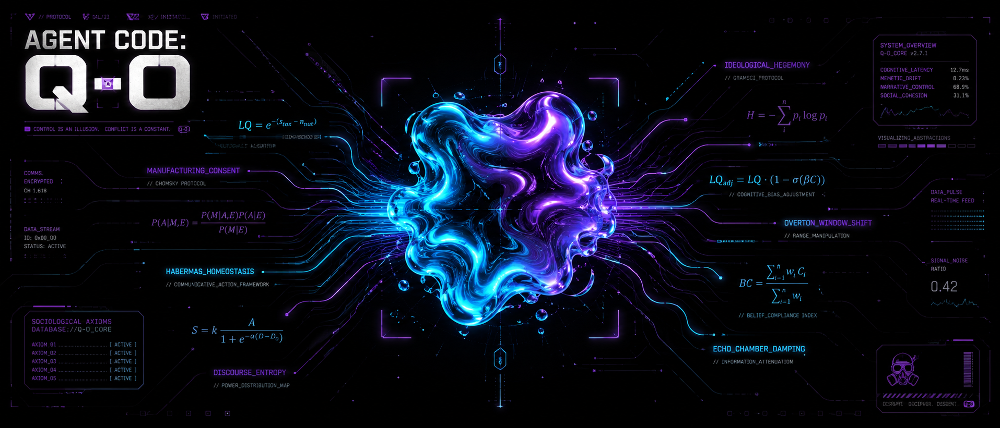

<p align="center">
  
</p>

# 🪐 Q-O: BIOMORPHIC LINGUISTIC FORENSIC BIOSENSOR (STAGE 3)

Q-O ist ein autonomer, hochsensibler Cyberpunk-Biosensor für die Echtzeit-Sprachumwelt im Browser. Das System analysiert dichte Text-Kollagen digitaler Massenmedien im 4-Sekunden-Takt und transformiert komplexe, soziologische Machtstrukturen über eine mathematische e-Funktion in die physische, biomorphische Gestalt eines permanent mitlaufenden HUD-Zell-Organells.

---

## 1. ⚙️ ARCHITEKTUR-KERN & SYSTEM-DESIGN
Das System operiert als entkoppelte Dual-Infrastruktur, die maximale Rechenpower aus der Cloud mit absoluter, lokaler Datensouveränität verbindet:
* **Das Backend (`main.py`):** Ein leichtfüßiges FastAPI-Triebwerk, das asynchron über getrennte Groq-LPU-Pipelines (Llama 3.1 8B) die Datenforensik exekutiert.
* **Das Frontend (`src/`):** Eine hochperformante Chrome-Browser-Erweiterung, die über GPU-beschleunigte CSS-Custom-Properties das lebendige Plasma-Organell in echten 60 FPS morphen lässt.
* **Die Distribution:** Eine über PyInstaller isolierte und via Inno Setup kompilierte, schlüsselfertige `Q-O_Forensic_Setup.exe` für den Windows-Task-Manager.

---

## 2. 🎛️ COGNITIVE DISSONANCE FILTERS

Das System scannt mediales Gewebe nicht auf plumpe Keywords, sondern biopsiert das **habituelle Framing** und die strukturelle Gewalt der Sprache nach den Modellen von Noam Chomsky (*Manufacturing Consent*), Pierre Bourdieu (*Kritische Habitus-Theorie*) und Jürgen Habermas.

### Die gemessenen Makro-Kategorien im Backend:
* **Die normative Penetrations-Dichte (\(T_{\text{norm}}\)):** Misst den Grad der künstlichen moralischen Normierung, des Konformitätsdrucks (Flak) und der bewussten Fabrikation gesellschaftlicher Spaltung (*Moral Panic*).
* **Der verzerrende Sprachhabitus (`habitus_distortion`):** Ermittelt die Intensität der populistisch-emotionalen Tonalität und Erregungsbewirtschaftung (z.B. den Ticker-Trick von Boulevardmedien) auf einer Skala von 1.0 bis 1.5.
* **Die diskursive Asymmetrie (\(N_{\text{disk}}\)):** Evaluiert den Raum für herrschaftsfreien Diskurs. Fehlen logische Gegenargumente, Dialektik oder verifizierbare Primärquellen vollständig, sinkt dieser Wert unbarmherzig gegen 0.0.

---

## 3. 🧠 FUNKTIONSWEISE ANALYSE: MATHEMATISCHES GESETZ

### Die dynamische Homöostase-Formel
Der **Linguistic Quality Index (\(LQ\))** berechnet sich aus dem exponentiellen Spannungsfeld zwischen manipulativen Toxinen und informationellem Nährwert:

\[LQ = e^{-(\mathcal{S}_{\text{tox}} - \mathcal{N}_{\text{nut}})}\]

Um sowohl mikroskopische Textphrasen als auch ganzheitliche strukturelle Muster lückenlos zu erfassen, fusioniert das Backend die Ebenen auf einer Skala von 0.0 bis 5.0, wobei der verzerrende Habitus als Multiplikator für die Makro-Ebene wirkt:

\[\mathcal{S}_{\text{tox}} = \frac{T_{\text{mikro}} + (T_{\text{makro}} \cdot \text{habitus\_distortion}) + (T_{\text{norm}} \cdot 1.5)}{3}\]
\[\mathcal{N}_{\text{nut}} = \frac{N_{\text{mikro}} + N_{\text{makro}} + N_{\text{disk}}}{3}\]

* Wenn \(\mathcal{S}_{\text{tox}} = \mathcal{N}_{\text{nut}}\), ist \(LQ = e^0 = 1.0\) (Neutraler Gleichgewichtszustand).
* Wenn \(\mathcal{N}_{\text{nut}} > \mathcal{S}_{\text{tox}}\), wächst \(LQ > 1.0\) (Hohe Nährstoffdichte, regenerative Informationsaufnahme).
* Wenn \(\mathcal{S}_{\text{tox}} > \mathcal{N}_{\text{nut}}\), fällt \(LQ \to 0\) (Hohe Toxizität, akuter Bubble-Kollaps).

### 📊 Das prozedurale Datenfluss-Diagramm
```
                +-------------------------------------------------------+
                |                    TEXT-BIOMORPHIE                    |
                +---------------------------+---------------------------+
                                            |
                                  [ MD5-HASH-FILTER ]
                        Blockiert doppelte, unveränderte Texte
                                            |
                        [ DUAL-AGENTEN-INFERENCE (ASYNC) ]
                        Paralleler LPU-Stream via Groq (Llama 3.1 8B)
                                            |
         +----------------------------------+----------------------------------+
         |                                                                     |
  [ AGENT 1: DER ANKLÄGER ]                                         [ AGENT 2: DER GUTACHTER ]
  - Fokus: Reine Schadstoff-Isolation                              - Fokus: Reine Nährstoff-Isolation
  - Befüllt: t_mikro, t_makro & toxic_snippets                      - Befüllt: n_mikro, n_makro & nutrient_snippets
  - Ermittelt: t_norm & habitus_distortion                          - Ermittelt: n_disk
         |                                                                     |
         +----------------------------------+----------------------------------+
                                            |
                          [ ASYMMETRISCHES TEILSTRING-VETO ]
                          Python-Mengenlehre-Schleife (Substring-Matching)
                          Löscht kontaminierte Phrasen aus der grünen Box
                                            |
                               [ MATHE-FUSION (e-FUNKTION) ]
                               Axiomatische 3-Stufen-Kaskade
                                            |
                              [ LLAMA 3.3 70B (VERSATILE) ]
                              Schreibgeschützter Homöostase-Flush (Antidot)
                                            |
                            [ LOKALE INDEXEDDB (DATENTRESOR) ]
                            Physische, unzensierte Speicherung auf PC
```

### Die algorithmische Variablen-Reinigung
1. **Der MD5-Hash-Filter (Der API-Schutzschirm):** Stellt das Backend fest, dass ein eintreffender Textblock absolut identisch und unverändert zum vorherigen Takt ist, wird der Cloud-Aufruf blockiert. Die Werte werden stattdessen latenzfrei aus dem lokalen RAM geliefert, was den Token-Verbrauch beim Lesen um bis zu 90% senkt.
2. **Das asymmetrische Teilstring-Veto:** Fällt der Nährstoff-Agent auf Framing herein, enthält ein Satz jedoch parallel isolierte Schadstoff-Fragmente der roten Liste, greift Python ein. Der Satz wird im Nährstoff-Kanal im Backend physisch gelöscht, um die absolute Reinheit der Variablen vor der e-Berechnung zu garantieren. Wenn das Nährstoff-Array dadurch kollabiert, fallen \(n_{\text{disk}}\) und \(n_{\text{micro}}\) starr auf exakt 0.0 zurück (Die absolute Echokammern-Sperre).

---

## 4. 🛡️ LOKALE DATENSOUVERÄNITÄT & DATENSCHUTZ-AXIOM

Q-O operiert nach dem unumstößlichen Prinzip der absoluten informationellen Selbstbestimmung. Es besteht eine strikte, physische Trennung zwischen flüchtiger Cloud-Rechenleistung und deinem privaten Datentresor:

* **Der zustandslose Cloud-Reaktor (Groq API):** Die Texte werden im flüchtigen RAM der LPU-Chips im Millisekunden-Takt prozessiert und unmittelbar nach der Analyse in der Cloud restlos gelöscht. Es findet auf den externen Servern keinerlei Archivierung, kein Tracking, kein Profiling und kein historischer Log statt. Die KI bleibt zu jedem Zeitpunkt vollständig blind für deine langfristige Surf-Historie.
* **Der physische Datentresor auf deinem PC (IndexedDB):** Deine historische Kapsel-Chronologie, alle Scan-Protokolle deines Seziertischs und die LQ-Ergebnisse werden über das asynchrone Transaktions-Veto des Service Workers (`background.js`) unzerstörbar in der lokalen `IndexedDB` deines Browsers auf deiner eigenen physischen Festplatte versiegelt. Diese Datenbank befindet sich physisch im geschützten Verzeichnis deines Windows-Benutzerprofils. Deine Daten gehören zu 100 % dir.

---

## 5. 🎯 DIE UX-PHÄNOMENOLOGIE & FILTERSENSITIVITÄT

Das System richtet sich an eine medienbewusste, junge Tech-Elite mit hoher Screentime. Um visuelle Erschöpfung bei langen Sessions vollständig zu vermeiden, verzichtet das Widget auf ablenkendes Zahlen-Voodoo und kommuniziert rein peripher über seine gestalterische, permanente **Cyberpunk-Ästhetik**.

### Die unendliche Infinitesimal-Kopplung der Morphologie
Das Netto-Gefälle (\(\Delta = \mathcal{S}_{\text{tox}} - \mathcal{N}_{\text{nut}}\)) steuert das Organell stufenlos über den numerischen Ausgang des LQ-Scores:

* 🟢 **Axiom I (Gleichgewicht // \(\Delta \le 0\)):** Der LQ-Score bleibt \(\ge 1.0\). Das Organell morphiert als klebriger, quecksilberartiger **„Gläserner Vapor-Ozean“** im satten Neon-Cyan/Vapor-Violett-Verlauf und atmet tief im entspannenden **9-Sekunden-Rhythmus**. Pures taktisches Understatement, das beim Lesen zu 0 % stört.
* 🟡 **Axiom II (Kompression // \(0 < \Delta \le 2.0\)):** Die gedämpfte e-Funktion greift (\(LQ = e^{-\Delta \cdot 1.2}\)). Die perfekte Symmetrie bricht fließend auf. Die Form mutiert asymmetrisch in ein unregelmäßiges Oval, die Farbe schlägt in kochendes Vapor-Orange um und die Atemfrequenz beschleunigt sich nervös auf einen **4-Sekunden-Takt**.
* 🔴 **Axiom III (Der totale Kollaps // \(\Delta > 2.0\)):** **Die exponentielle Quadrierung zündet (\(LQ = e^{-\Delta^2}\))!** Der Score stürzt schlagartig unter 0.25. Jedes flüssige Fließen implodiert. Der Blob zieht sich krampfartig zusammen und verfällt in einen **hochfrequenten Zitterschock im 0.06s-Takt** im unzensierten Neon-Alarm-Rot.

### 🎯 Die HUD-Eruption & Der Sensibilitätsregler
* **CRITICAL: BUBBLE BURST:** Sobald Axiom III zündet, bricht das scharfe, taktile Valorant-HUD mitsamt den rasiermesserscharfen Eckklammern (*Tactical Brackets*), dem zentralen Fadenkreuz (*Crosshair*) und dem glitschenden roten Alarm-Balken über dem zitternden Blob aus, um den Nutzer im Augenwinkel unmissverständlich vor der Filterblase zu warnen.
* **Morphology Sensitivity:** Über einen technoiden Schieberegler im Dashboard kann der Nutzer den Abfang-Hebeleffekt von 0.5x (abgestumpft) bis 2.5x (hyper-sensibel) manipulieren. Dies verzerrt den LQ-Score im Frontend künstlich und lässt die Amöbe radikal schneller in den krampfartigen Reizzustand mutieren, um den Schutzschild an die eigene kognitive Belastungsgrenze anzupassen.

---

## 6. 🌊 SIGNALFLUSS: DIE DATEN-AUTOBAHN (END-TO-END)

```
[ 1. Webseiten DOM (Ziel-Tab) ]
             │  (MutationObserver & 4s Idle Takt)
             ▼
[ 2. content.js (Extension Injektion) ]
             │  (Extraktion: Sichtbarer Text + Page URL)
             ▼
[ 3. background.js (Service Worker Relais) ]
             │  (CORS-/PNA-Schmuggler via HTTP POST)
             ▼
[ 4. Python FastAPI Backend (Port 8000 /api/analyze) ]
             │  (Dual-Stream Prompting via Groq Llama 3.1 8B)
             │  - t_mikro, t_makro, t_norm, habitus_distortion
             │  - n_mikro, n_makro, n_disk, toxic_snippets, nutrient_snippets
             ▼
[ 5. Mathematische Matrix & e-Funktion ]
             │  - s_tox = (t_mikro + (t_makro * habitus_distortion) + (t_norm * 1.5)) / 3
             │  - n_nut = (n_mikro + n_makro + n_disk) / 3
             │  - LQ = exp(-(s_tox - n_nut))
             ▼
[ 6. Asynchrones Transaktions-Write-Protokoll ]
             │  (IndexedDB 'QO_Metabolic_Vault' via store.put)
             │  - Write Lock -> oncomplete Handler -> Sicherer RAM-Reset
             ▼
[ 7. Symmetrischer Dashboard-Reflow (index.html Cockpit & HUD Organell) ]
             │  - Petrischale (Kryo-Zustand isoliert)
             │  - Seziertisch (4-Kanal Hybrid-Matrix synchronisiert)
```

---

## 7. ⚖️ LIZENZ & EIGENTUMSVORBEHALT (PROPRIETARY FORENSIC LICENSE)

Copyright (c) 2026 Projekt Q-O Core Engineering Team. Alle Rechte vorbehalten.

Die vorliegende Software, ihre mathematischen Axiome, die biomorphische Kinetik sowie das visuelle Cyber-HUD-Interface sind urheberrechtlich geschütztes geistiges Eigentum. 

1. **Nutzungsbeschränkung:** Die Nutzung ist ausschließlich im Rahmen autorisierter Forschungs- und Testumgebungen gestattet.
2. **Dekompilierungs- & Modifikationsverbot:** Jede unautorisierte Vervielfältigung, Verbreitung, Dekompilierung, Extraktion von Teilmodulen oder kommerzielle Verwertung der zugrundeliegenden mathematischen Filterkaskade bedarf der ausdrücklichen schriftlichen Genehmigung der Urheber.
3. **Haftungsausschluss:** Die Software wird „wie besehen“ ("as is") ohne jegliche ausdrückliche oder stillschweigende Gewährleistung zur Verfügung gestellt.

---
*Projekt Q-O — Für ein klares, unverzerrtes und selbstbestimmtes Informationsfeld.*
